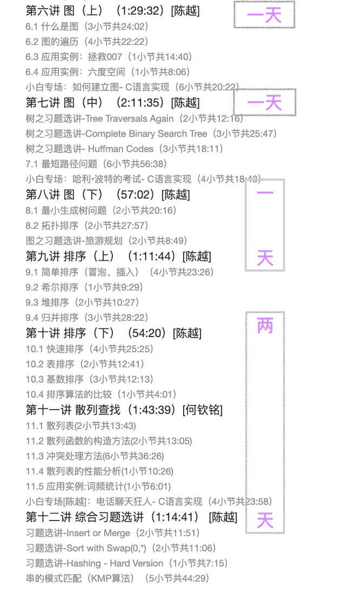
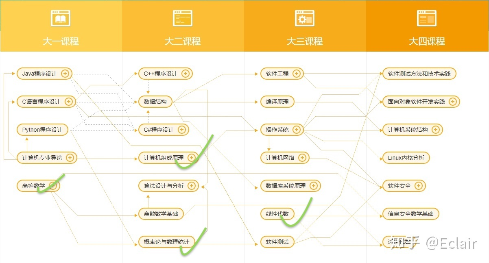

## 编程学习进度

### 操作系统

- [x] 视频课程
- [ ] 实验作业:差最后一个实验和四个大实验

### 计算机网络

- [x] 视频课程 : 差最后的安全章节
- [ ] 实验作业 : 未完成

### 数据库

- [x] 视频课程 : 看完了十讲 , 剩十三讲
- [ ] 实验作业 : 六次作业 ,四次实验

### 数据结构与算法

- [ ] 视频课程:一半

  

- [ ] 实验作业 : 实现各种数据结构的操作

### java

- [ ] 视频课程
- [ ] 实验作业

### Android 开发

- [ ] 视频课程
- [ ] 实验作业

### 算法设计与分析

- [ ] 视频课程 :
- [ ] 实验作业 : leetcode 写完

### 计算机系统结构

- [ ] 视频课程:一半
- [ ] 实验作业

### 深入理解计算机系统(CSAPP 好像是本书 , )

- [ ] 视频课程:一半
- [ ] 实验作业

### 设计模式

- [ ] 视频课程
- [ ] 实验作业

### 计算机体系结构

- [ ] 视频课程
- [ ] 实验作业

### 编译原理

- [ ] 视频课程
- [ ] 实验作业

## 已完成

### ✅计算机组成原理

- [x] 视频课程
- [x] 实验作业 : 课程内容不是重要知识 , 了解即可, 没有完成

## 路线

 知乎回答：

- 同国内某本科，按照我当时上学的经验去看，你说的电工数电组成原理都是大二下学期的课，c大一上学期，c++大一下学期，Java大二上学期，数据结构大二上学期，算法机组大二下学期，操作系统计网大三上学期，编译原理大三下学期。大致差不多就这些。至于大四，都出去实习了。

- 四大专业课
  - 计算机组成与体系结构
  - 操作系统
  - 计算机网络
  - 编译原理

